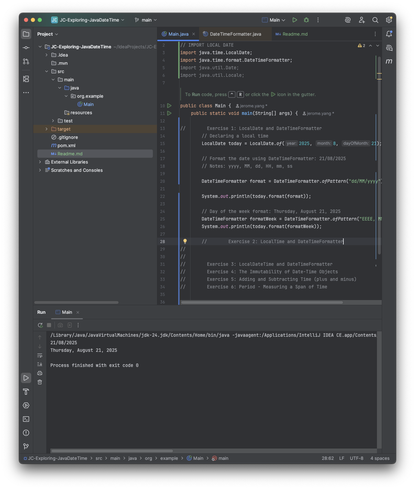
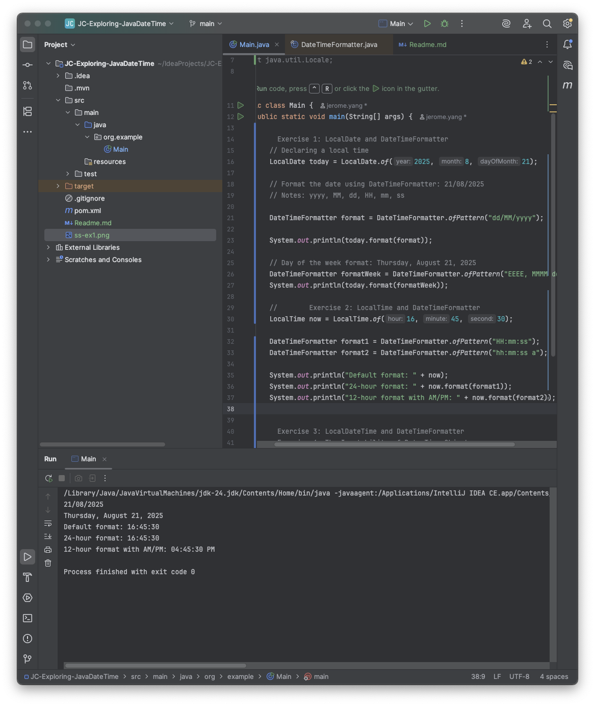
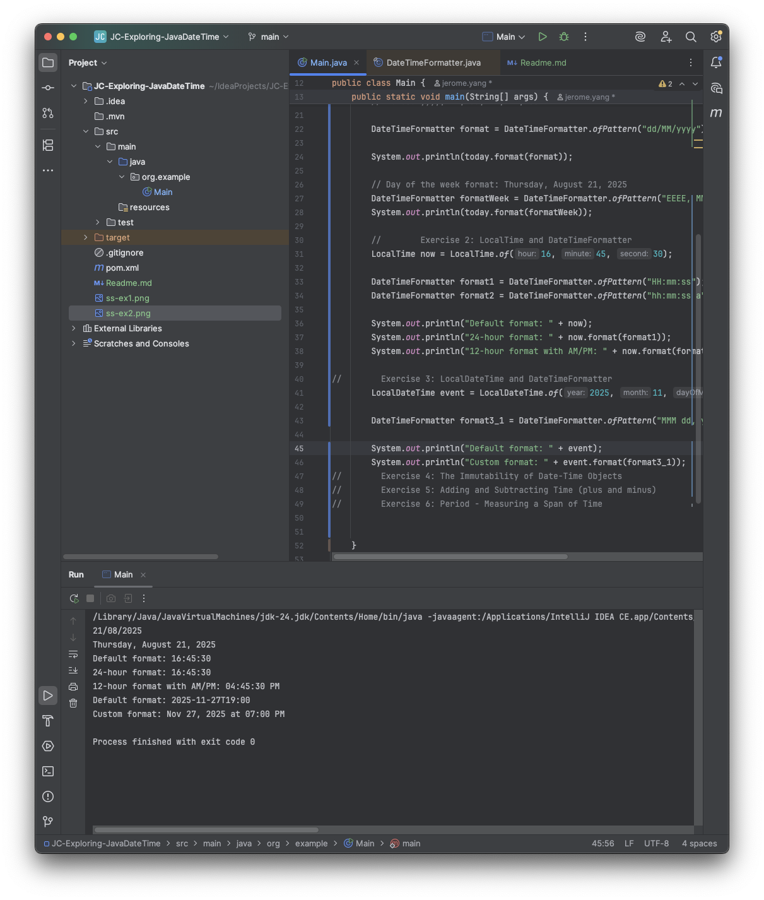
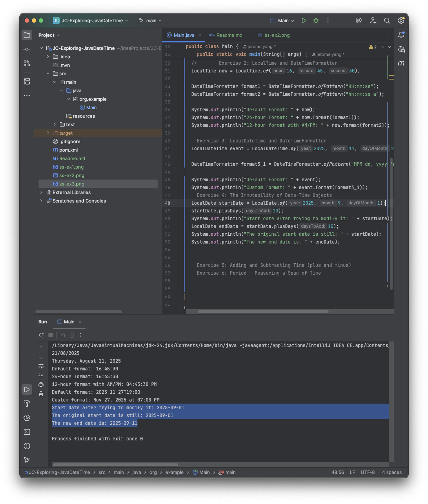
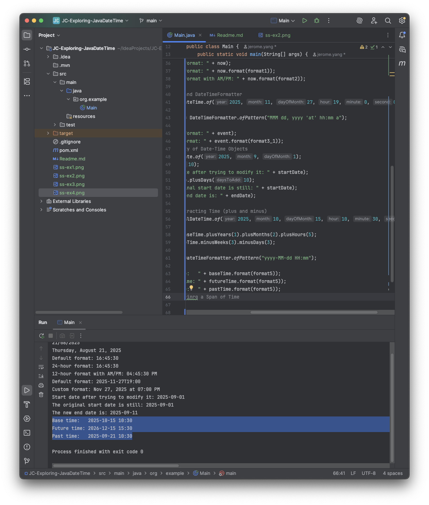
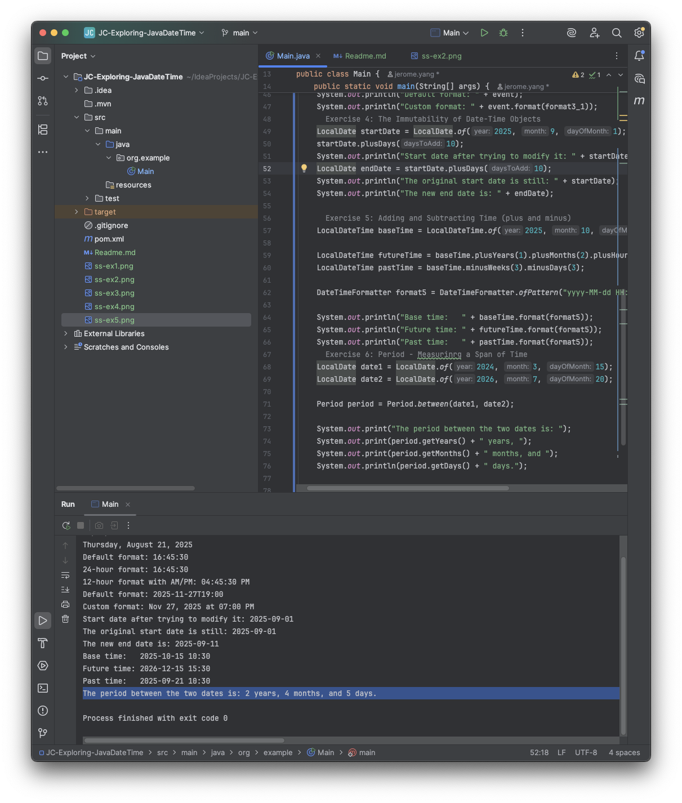

# Exploring Java Data and Time API

## Exercise 1: LocalDate and DateTimeFormatter

Program Output:

## Exercise 2: LocalTime and DateTimeFormatter
1. Prediction: What do you think will be the output?
- It will print 4:45 or 16:45 in the 24 hr format

2. Observation: Now, run the code. What is the actual output?
Program Output:
```
24-hour format: 16:45:30
12-hour format with AM/PM: 04:45:30 PM
```

## Exercise 3: LocalDateTime and DateTimeFormatter
1. Prediction: What do you think will be the output?
    - it will show a date that shows a 3 day format of the month `MMM` = `Nov`, the day `dd` 27, the year in 4 `yyyy` 2025 and the time at 12 hr format `hh:mm` 07:00 (HH for 24 hr), lastly the `a` for AM/PM marker
2. Observation: Now, run the code. What is the actual output?
```
Default format: 2025-11-27T19:00
Custom format: Nov 27, 2025 at 07:00 PM
```
   

## Exercise 4: The Immutability of Date-Time Objects

1. Prediction: What do you think will be the output?
    - The initial output will be the first date shown; September 1, 2025 in its default format 2025-09-01
    - Add 10 days it will be printed as the end day: 2025-09-11

2. Observation: Now, run the code. What is the actual output?
```
Start date after trying to modify it: 2025-09-01
The original start date is still: 2025-09-01
The new end date is: 2025-09-11
```
   
## Exercise 5: Adding and Subtracting Time (plus and minus)
1. Prediction: What do you think will be the output?
   - The input is year 2025, month 10, day 15, hour 10, minute 30, and seconds 0
   - Base time will be 2025-10-15 10:30
   - Future time after adding 1 year, 2 months and 5 hours: 2026-12-15 15:30
   - Past time after subtracting 3 weeks and 3 days (24 days): 2025-09-16 15:30
2. Observation: Now, run the code. What is the actual output?
```
Base time:   2025-10-15 10:30
Future time: 2026-12-15 15:30
Past time:   2025-09-21 10:30
```

## Exercise 6: Period - Measuring a Span of Time

1. Prediction: What do you think will be the output?
   - 2 years, 4 months, 5 days

2. Observation: Now, run the code. What is the actual output?
```
The period between the two dates is: 2 years, 4 months, and 5 days.
```




